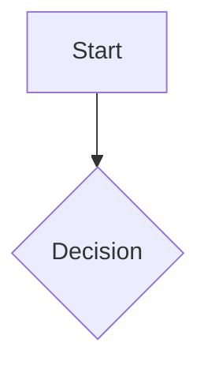
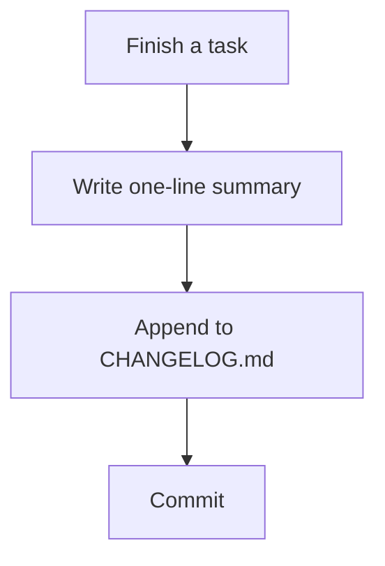

# Workflow Validation Process Implementation Plan

> **For agentic workers:** REQUIRED SUB-SKILL: Use superpowers:subagent-driven-development (recommended) or superpowers:executing-plans to implement this plan task-by-task. Steps use checkbox (`- [ ]`) syntax for tracking.

**Goal:** Stand up the directory structure, templates, and living anti-pattern checklist that let any candidate workflow run through the Brainstorm → Diagram → Success Criteria → Test Plan → Trials/Trial Log → Verdict loop defined in `docs/superpowers/specs/2026-08-05-workflow-validation-process-design.md`.

**Architecture:** A `workflows/` directory holds a `_template/` set of five per-stage artifact templates, a top-level `anti-patterns.md` living checklist, a `README.md` operator guide, and a filled `_example/` dry run that proves the templates work. No code and no CLI — the spec defers the delivery substrate, so this plan ships process scaffolding only.

**Tech Stack:** Markdown and Mermaid diagrams only. No programming language, build tooling, or test runner.

---

## File Structure

- Create: `workflows/README.md` — operator guide: summarizes the 6-stage loop, explains how to start a new candidate workflow, links to the design spec.
- Create: `workflows/anti-patterns.md` — the living anti-pattern checklist, seeded from the spec.
- Create: `workflows/_template/brainstorm.md` — Stage 0 template.
- Create: `workflows/_template/diagram.md` — Stage 1 template.
- Create: `workflows/_template/criteria.md` — Stage 2 template.
- Create: `workflows/_template/test-plan.md` — Stage 3 template.
- Create: `workflows/_template/trial-log.md` — Stage 4 template.
- Create: `workflows/_example/brainstorm.md`, `diagram.md`, `criteria.md`, `test-plan.md`, `trial-log.md` — a filled dry run against a trivial toy workflow (a changelog-entry workflow), proving the templates capture what a real run needs.
- Modify: `CLAUDE.md` — add a pointer to `workflows/`.

Each template file matches its example counterpart field-for-field — the example task on this plan cannot invent a field the template does not define, and cannot skip a field the template does define.

---

### Task 1: Anti-pattern checklist

**Files:**
- Create: `workflows/anti-patterns.md`

- [ ] **Step 1: Write the checklist file**

```markdown
# Anti-Pattern Checklist

This checklist grows over time. Check every candidate workflow against it during the Brainstorm stage. When development reveals a new anti-pattern, append it here — the checklist applies to every future workflow brainstorm, not just the one that surfaced the new entry.

Source: `docs/superpowers/specs/2026-08-05-workflow-validation-process-design.md`

## Checklist

- Does this add a phase gate that doesn't earn its ceremony?
- Does this require a dedicated SME or agent, when a checklist or a single prompt could serve the same purpose?
```

- [ ] **Step 2: Self-review against STE + E-Prime**

Re-read the file. Confirm: no sentence exceeds ~25 words, no banned "to be" forms (is/are/was/were/be/being/been or their contractions), active voice throughout, imperative mood for instructions.

- [ ] **Step 3: Commit**

```bash
git add workflows/anti-patterns.md
git commit -m "docs: add workflow anti-pattern checklist"
```

---

### Task 2: Brainstorm template

**Files:**
- Create: `workflows/_template/brainstorm.md`

- [ ] **Step 1: Write the template file**

```markdown
# Brainstorm — <Workflow Name>

**Date:**
**Stage:** 0 — Brainstorm

## Prior Art Reviewed

<!-- Describe how Casita approached this, if it did. Describe how other frameworks (spec-kit, superpowers) approach it. Describe first-principles alternatives. -->

## Approaches Considered

<!-- List 2-3 rough approaches. Add one "### Approach" heading per approach considered. -->

### Approach A

### Approach B

## Anti-Pattern Check

<!-- Check each approach above against workflows/anti-patterns.md. Record the result for each question. -->

## Recommendation

<!-- State the chosen approach and explain why. -->

## Rejected Approaches

<!-- For each rejected approach, state why the team rejected it. -->
```

- [ ] **Step 2: Self-review against STE + E-Prime**

Re-read the file. Confirm every instruction comment uses imperative mood and contains no banned "to be" forms.

- [ ] **Step 3: Commit**

```bash
git add workflows/_template/brainstorm.md
git commit -m "docs: add brainstorm stage template"
```

---

### Task 3: Diagram template

**Files:**
- Create: `workflows/_template/diagram.md`

- [ ] **Step 1: Write the template file**

````markdown
# Diagram — <Workflow Name>

**Date:**
**Stage:** 1 — Diagram

## Flow / State Diagram

<!-- Sketch the chosen approach as a mermaid flow or state diagram. Capture entry points, steps, decision points, gates, and exit or failure states. -->



## Notes

<!-- Record open questions or assumptions the diagram makes. -->
````

- [ ] **Step 2: Self-review against STE + E-Prime**

Re-read the file. Confirm the instruction comments use imperative mood and contain no banned "to be" forms.

- [ ] **Step 3: Commit**

```bash
git add workflows/_template/diagram.md
git commit -m "docs: add diagram stage template"
```

---

### Task 4: Success criteria template

**Files:**
- Create: `workflows/_template/criteria.md`

- [ ] **Step 1: Write the template file**

```markdown
# Success Criteria — <Workflow Name>

**Date:**
**Stage:** 2 — Success Criteria

## Falsifiable Criteria

<!-- State what "this workflow works" means in checkable terms. Example: "produces a correct spec.md with at most 1 manual correction, across at least 3 of 4 trials, including one synthetic and one real-project environment." -->

## Minimum Trial Coverage

<!-- State the minimum number and mix of trials (synthetic vs. real-project) the workflow needs before a Verdict. -->
```

- [ ] **Step 2: Self-review against STE + E-Prime**

Re-read the file. Confirm the instruction comments use imperative mood and contain no banned "to be" forms.

- [ ] **Step 3: Commit**

```bash
git add workflows/_template/criteria.md
git commit -m "docs: add success criteria stage template"
```

---

### Task 5: Test plan template

**Files:**
- Create: `workflows/_template/test-plan.md`

- [ ] **Step 1: Write the template file**

```markdown
# Test Plan — <Workflow Name>

**Date:**
**Stage:** 3 — Test Plan

## Trial Scenarios

| # | Environment | Driver | Variation |
|---|---|---|---|
| 1 | | | |
| 2 | | | |
| 3 | | | |

<!-- Add or remove rows to match the trial count set in criteria.md. The number 3 serves only as a starting point, not a requirement. -->
<!-- State the environment: synthetic test project, or sandboxed copy of a real project. -->
<!-- State the driver: hands-on, or autonomous agent run. -->
<!-- State the variation: how this trial differs from the others — project size or language, ambiguous requirements, mid-workflow interruption, and so on. -->
```

- [ ] **Step 2: Self-review against STE + E-Prime**

Re-read the file. Confirm the instruction comments use imperative mood and contain no banned "to be" forms.

- [ ] **Step 3: Commit**

```bash
git add workflows/_template/test-plan.md
git commit -m "docs: add test plan stage template"
```

---

### Task 6: Trial log template

**Files:**
- Create: `workflows/_template/trial-log.md`

- [ ] **Step 1: Write the template file**

```markdown
# Trial Log — <Workflow Name>

**Stage:** 4 — Trials + Trial Log

Append-only. Add a new entry per trial; do not edit past entries.

## Trial 1

<!-- Add one "## Trial N" heading per trial, incrementing N. Never edit a previous entry's fields. -->

**Date:**
**Environment:**
**Driver:**
**Outcome:** <!-- State whether the trial met the criteria in criteria.md. -->
**Friction:** <!-- Record every point where a human intervened, corrected output, or where the diagram did not match reality. -->
```

- [ ] **Step 2: Self-review against STE + E-Prime**

Re-read the file. Confirm the instruction comments use imperative mood and contain no banned "to be" forms.

- [ ] **Step 3: Commit**

```bash
git add workflows/_template/trial-log.md
git commit -m "docs: add trial log stage template"
```

---

### Task 7: Operator guide (README)

**Files:**
- Create: `workflows/README.md`

- [ ] **Step 1: Write the README file**

```markdown
# Workflow Validation Process

This directory holds the working files for the Workflow Validation Process, defined in `docs/superpowers/specs/2026-08-05-workflow-validation-process-design.md`. Read that spec first — this README only summarizes it.

## Starting a New Candidate Workflow

1. Create a directory: `workflows/<workflow-name>/`.
2. Copy each file from `workflows/_template/` into the new directory.
3. Work through the stages in order: Brainstorm, Diagram, Success Criteria, Test Plan, Trials + Trial Log, Verdict.
4. Check every approach in `brainstorm.md` against `workflows/anti-patterns.md`.
5. On a Ship verdict, promote `diagram.md` and `criteria.md` into the workflow's canonical spec.
6. On a Kill verdict, return to `brainstorm.md` and revise the approach.

## Example

See `workflows/_example/` for a filled-out dry run of this process against a trivial toy workflow.

## Files

| File | Stage |
|---|---|
| `brainstorm.md` | 0 |
| `diagram.md` | 1 |
| `criteria.md` | 2 |
| `test-plan.md` | 3 |
| `trial-log.md` | 4 |
```

- [ ] **Step 2: Self-review against STE + E-Prime**

Re-read the file. Confirm every sentence stays under ~25 words, uses active voice, and contains no banned "to be" forms.

- [ ] **Step 3: Commit**

```bash
git add workflows/README.md
git commit -m "docs: add workflow validation process operator guide"
```

---

### Task 8: Dry-run example — validate the templates

**Files:**
- Create: `workflows/_example/brainstorm.md`
- Create: `workflows/_example/diagram.md`
- Create: `workflows/_example/criteria.md`
- Create: `workflows/_example/test-plan.md`
- Create: `workflows/_example/trial-log.md`

This task fills out every template against a trivial toy workflow — a "write one changelog line after finishing a task" workflow — to prove the template set captures what a real run needs. This is the closest equivalent to a test in a process/documentation deliverable: if a field in the templates turns out to be unfillable or a needed field is missing, that is a defect the earlier tasks must fix before this task can pass.

- [ ] **Step 1: Fill out the brainstorm example**

```markdown
# Brainstorm — Changelog Entry Workflow (example)

**Date:** 2026-08-05
**Stage:** 0 — Brainstorm

## Prior Art Reviewed

Casita required a full changelog entry at Acceptance, written by hand with no template. Spec-kit does not define a changelog step. This example explores a minimal, templated alternative.

## Approaches Considered

### Approach A

A single-line template: date, one-sentence summary, link to the commit.

### Approach B

A structured template with separate fields for change type, motivation, and impact.

## Anti-Pattern Check

- Phase gate ceremony: Approach B adds a review gate before the entry counts as complete. That gate does not earn its ceremony for a one-line record.
- Dedicated SME or agent: Neither approach needs one; a template fills this need.

## Recommendation

Approach A. It captures the minimum useful record and adds no gate.

## Rejected Approaches

Approach B: the extra fields and gate cost more effort than the entries deliver in value, for a change this small.
```

- [ ] **Step 2: Fill out the diagram example**

````markdown
# Diagram — Changelog Entry Workflow (example)

**Date:** 2026-08-05
**Stage:** 1 — Diagram

## Flow / State Diagram



## Notes

The diagram assumes CHANGELOG.md already exists. A missing file needs a setup step this example does not cover.
````

- [ ] **Step 3: Fill out the criteria example**

```markdown
# Success Criteria — Changelog Entry Workflow (example)

**Date:** 2026-08-05
**Stage:** 2 — Success Criteria

## Falsifiable Criteria

The workflow produces one CHANGELOG.md line per task, in the format `- <date>: <summary>`, with zero manual corrections, across at least 3 of 3 trials.

## Minimum Trial Coverage

Three trials minimum: two synthetic, one against a sandboxed real project.
```

- [ ] **Step 4: Fill out the test plan example**

```markdown
# Test Plan — Changelog Entry Workflow (example)

**Date:** 2026-08-05
**Stage:** 3 — Test Plan

## Trial Scenarios

| # | Environment | Driver | Variation |
|---|---|---|---|
| 1 | Synthetic | Autonomous agent run | Single small task |
| 2 | Synthetic | Autonomous agent run | Task with an ambiguous summary |
| 3 | Sandboxed real project | Hands-on | Existing CHANGELOG.md with inconsistent formatting |
```

- [ ] **Step 5: Fill out the trial log example**

```markdown
# Trial Log — Changelog Entry Workflow (example)

**Stage:** 4 — Trials + Trial Log

Append-only. Add a new entry per trial; do not edit past entries.

## Trial 1

**Date:** 2026-08-05
**Environment:** Synthetic
**Driver:** Autonomous agent run
**Outcome:** Met criteria. The agent appended one correctly formatted line.
**Friction:** None.

## Trial 2

**Date:** 2026-08-05
**Environment:** Synthetic
**Driver:** Autonomous agent run
**Outcome:** Missed criteria. The agent wrote a two-sentence summary instead of one line.
**Friction:** A human shortened the summary to one line by hand.
```

- [ ] **Step 6: Verify template coverage**

Compare each `_example/*.md` file against its `_template/*.md` counterpart. Confirm every fixed field defined in the template got a value in the example. Repeatable sections (`### Approach`, `## Trial N`) can occur a different number of times in the example than in the template — check that each occurrence carries the same field set, not that the count matches. Confirm the example introduced no field the template does not define. Fix either file if a mismatch turns up.

- [ ] **Step 7: Commit**

```bash
git add workflows/_example/
git commit -m "docs: add dry-run example validating workflow templates"
```

---

### Task 9: Link the process from CLAUDE.md

**Files:**
- Modify: `CLAUDE.md`

- [ ] **Step 1: Add a pointer to the workflows directory**

In `CLAUDE.md`, in the "Project status" section, change:

```markdown
Design specs live in `docs/superpowers/specs/`. See `docs/superpowers/specs/2026-08-05-workflow-validation-process-design.md` for the first sub-project: a repeatable process for designing, diagramming, testing, and validating any candidate workflow's efficacy before it ships into the framework.
```

to:

```markdown
Design specs live in `docs/superpowers/specs/`. See `docs/superpowers/specs/2026-08-05-workflow-validation-process-design.md` for the first sub-project: a repeatable process for designing, diagramming, testing, and validating any candidate workflow's efficacy before it ships into the framework. The working templates and operator guide for that process live in `workflows/` — start there to run a workflow through the process.
```

- [ ] **Step 2: Commit**

```bash
git add CLAUDE.md
git commit -m "docs: point CLAUDE.md at the workflows/ process scaffolding"
```

---

## Definition of Done

- `workflows/README.md`, `workflows/anti-patterns.md`, and all five `_template/*.md` files exist and pass the STE + E-Prime self-review.
- `workflows/_example/` contains a complete, filled dry run using every field defined in the templates, with no unexplained mismatches between template and example.
- `CLAUDE.md` points to `workflows/`.
- Every task above has its own commit.
