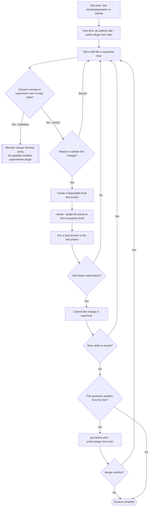

# Superpowers Fork — Design

**Date:** 2026-08-08
**Status:** Shipped (validated via `workflows/superpowers-fork/`)

## Context

`superfunk` forks `obra/superpowers` (MIT-licensed, `github.com/mattbran87/superfunk`) and reworks its skills with lessons from Casita. This spec covers only the fork/base-repo decision — how the fork's content enters `superfunk` and how development stays safe. Specific reworked mechanisms (change tiers, phase gates, spec artifact structure) each get their own future workflow.

This decision ran through the Workflow Validation Process. See `workflows/superpowers-fork/` for the full brainstorm, diagram, criteria, test plan, and trial log behind it.

## Decision

`superfunk` imports the fork via `git subtree add --prefix=plugin fork main`, placing the fork's content under a `plugin/` directory at the repo root. This avoids collisions with `superfunk`'s existing `docs/`, `workflows/`, and `CLAUDE.md` — both repos have files with matching names at the root. It also keeps `git subtree pull` available for future upstream syncs.

## Development and Testing Rules

- Sessions working in `superfunk` always run on the globally-installed `superpowers` plugin. They never run on `superfunk`'s own in-progress `plugin/` content as an active plugin.
- Validating a reworked skill means installing that in-progress build into a separate, disposable location. A session does this with `claude --plugin-dir <path>` (confirmed in Trials 2-3; see below). No one points `superfunk` itself at its own `plugin/` directory this way.

## Flow

## Falsifiable Criteria (validated)

1. **Import safety** — zero loss or corruption of existing `docs/` and `workflows/` content. Passed (Trial 1), with `core.longpaths` enabled as a required prerequisite on Windows.
2. **Local install works** — a disposable-project session, given a local-path plugin install, runs on the in-progress build's actual content. Passed, confirmed in 2 of 2 install trials (Trials 2-3), across both a skill-file edit and a hook-script edit.
3. **Isolation holds** — no `superfunk` dev session loads its own in-repo fork content as its active plugin. Passed, zero occurrences across all trials.
4. **Upstream sync works** — `git subtree pull` completes cleanly, or a session resolves conflicts without losing prior `superfunk`-side edits. Passed (Trial 4). The trial tested against a local stand-in remote rather than the real GitHub fork. A future trial should re-confirm this against real upstream changes once they exist.

## Follow-ups Carried Forward (non-blocking)

- Enable `git config core.longpaths true` as a standard one-time setup step for this repo on Windows.
- A future trial could test whether `--bare` combined with `--plugin-dir` produces a true clean-room session, if that ever matters for a specific validation.
- Separately from this decision: superpowers' own mandatory-instruction hook injection reads, out of context, identically to an adversarial prompt injection. A future workflow should cover how a reworked framework enforces skill usage without looking indistinguishable from an attack.
- Re-run the upstream-sync trial against the real GitHub fork once genuine upstream changes accumulate there.

## Deferred (per the earlier scoping decision)

Change tiers, phase gates with sign-off, and spec artifact structure — each Casita-inspired mechanism gets its own dedicated brainstorm and Workflow Validation Process run, not bundled into this decision.
