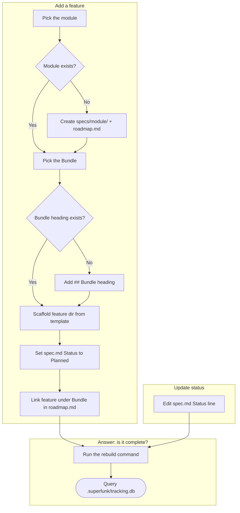

# Feature Tracking — Design

**Date:** 2026-08-10
**Status:** Shipped (validated via `workflows/feature-tracking/`)

## Context

`superfunk` needs Casita's roadmap equivalent, reworked around real codebase organization instead of one flat file. This spec covers the tracking structure, status handling, and feature intake — not the deeper feature-scoping conversation, which the existing brainstorming skill already covers.

This decision ran through the Workflow Validation Process. A four-lens exploration (`multi-lens-research`) and a user-proposed SQLite addition refined it further. See `workflows/feature-tracking/` for the full brainstorm, diagram, criteria, test plan, and trial log behind it.

## Decision

- **Module** — a directory mirroring a real codebase module/package: `specs/<module>/`.
- **`roadmap.md`** — hand-authored catalog per module. Bundles appear as `##` headings, purely organizational, carrying no status of their own. Features appear as links under their Bundle.
- **Feature** — a directory named with the `YYYY-MM-DD-<slug>` convention already used elsewhere in this repo, holding Casita's four files unchanged: `spec.md`, `tasks.md`, `decisions.md`, `notes.md`.
- **Status** — `spec.md`'s `Status:` line stays the single authoritative source. `roadmap.md` never carries a status column.
- **SQLite index** (`.superfunk/tracking.db`, gitignored) — `.superfunk/rebuild_index.py` walks every `spec.md` and rebuilds the index from scratch. Queries answer "is X complete" directly.
- **Templates** — `specs/_template/` holds the scaffold: `spec.md`, `tasks.md`, `decisions.md`, `notes.md`, and `roadmap.md` for a brand-new module.

## Feature Intake Procedure

1. Pick the module: an existing `specs/<module>/` directory, or create one with a fresh `roadmap.md`.
2. Pick the Bundle: an existing heading, or a new one.
3. Create `specs/<module>/<YYYY-MM-DD-slug>/` from `specs/_template/`.
4. Set `spec.md`'s `Status:` line to `Planned`.
5. Add a link for the feature under its Bundle heading in `roadmap.md`, matching the format `[Feature Name](./<feature-dir>/)`. Remove the template's instructional comment once the module has its first bundle and feature.
6. Rebuild the SQLite index. This step stays optional at this stage, since a `Planned` feature carries no urgency.

## Flow

## Falsifiable Criteria (validated)

1. **Intake correctness** — Passed (Trials 1-2). A fresh-module intake exposed two real defects (an inconsistent roadmap link format and a leftover instructional comment) that a pre-populated fixture had papered over. Fixed in `specs/_template/roadmap.md` and re-verified with a clean re-run.
2. **Index accuracy** — Passed (Trial 3). Every query matched its feature's actual `spec.md` Status line exactly, across 5 features spanning 2 modules, 3 bundles, and 4 status values, with zero mismatches.
3. **Git-nativeness preserved** — Passed (Trial 3). `.superfunk/tracking.db` never appeared as trackable in `git status`, confirmed as gitignored.

## Follow-ups Carried Forward (non-blocking)

- No defined home exists yet for a feature spanning multiple modules — flagged during the multi-lens exploration and in the Diagram's Notes, never resolved here.
- No fallback exists for a project not yet organized into modules, including `superfunk` itself today.
- Running the intake procedure via a non-interactive agent session needs write permissions granted up front. Otherwise it stalls on a prompt nobody can answer (Trial 1 finding).
- A dedicated command can replace the manual intake procedure later, once it proves itself, mirroring the same deferred-automation pattern chosen for the SQLite rebuild trigger.

## Deferred (per the earlier scoping decisions)

Change tiers, phase gates with sign-off, and the deeper feature-scoping/brainstorm process (closer to Casita's `/brainstorm`) each get their own dedicated workflow, not bundled into this decision.
