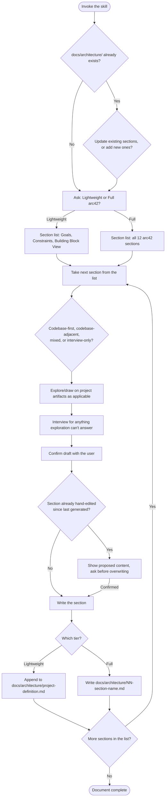

# Project Definition Skill — Design

**Date:** 2026-08-11
**Status:** Shipped (validated via `workflows/project-definition/`)

## Context

`feature-tracking` left an open question: when filing a feature and no module obviously fits, what decides which module it belongs to? Nothing in that design answered this — it assumed a codebase's decomposition into modules was already common knowledge, which doesn't hold for a new area of work or an unfamiliar codebase.

This spec closes that gap with a project-definition skill based on the arc42 architecture template (arc42.org), whose Building Block View section documents exactly the missing reference: a system's decomposition into components with clear boundaries and responsibilities.

This decision ran through the Workflow Validation Process. See `workflows/project-definition/` for the full brainstorm, diagram, criteria, test plan, and trial log behind it.

## Decision

- **Two tiers, user's explicit choice** — never inferred from project signals. Lightweight: Introduction and Goals, Constraints, Building Block View. Full: all 12 arc42 sections.
- **Shared location** — both tiers live under `docs/architecture/`. Lightweight writes one file, `docs/architecture/project-definition.md`. Full writes one file per section, `docs/architecture/NN-section-name.md`. A project can upgrade from lightweight to full later by adding files, not renaming anything.
- **A Claude Code Skill**, not a script — `plugin/skills/project-definition/SKILL.md`, since the task (interviewing, exploring, synthesizing) doesn't fit a deterministic script's shape. Built and tested under the same dev/test isolation rule `superpowers-fork` already validated: develop in-repo, never load `superfunk`'s own in-repo `plugin/` as the live session's active plugin, test via disposable `--plugin-dir` sessions in separate projects.
- **Per-section source strategy** — every arc42 section falls into one of four strategies, resolved during Trials:
  - *Codebase-first* (explore, then confirm): Building Block View, Runtime View, Deployment View.
  - *Codebase-adjacent* (draw from project artifacts, then confirm): Architecture Decisions, drawing on every `specs/<module>/<feature>/decisions.md` that exists.
  - *Mixed* (explore for a draft, then interview for the rest): Constraints, Context and Scope, Crosscutting Concepts, Risks and Technical Debt, Glossary.
  - *Interview-only*: Introduction and Goals, Solution Strategy, Quality Requirements.
- **Living document** — re-running the skill on a project that already has `docs/architecture/` updates it. Before overwriting any section a user hand-edited since it was last generated, the skill shows the proposed new content and asks for confirmation. It never silently overwrites.

## Flow

## Falsifiable Criteria (validated)

1. **Tier respected** — Passed (Trials 1, 3). Lightweight produced exactly 3 sections in 1 file; full produced exactly 12 correctly-named files. No extras, none missing, in either case.
2. **Codebase-derived content stays accurate** — Passed (Trials 1, 3). Verified against the real codebase directory-by-directory and file-by-file; zero fabricated modules. The full-tier trial's Building Block View even surfaced an unprompted, accurate "Notable Absences" observation, and Architecture Decisions correctly reported no decision history existed rather than inventing any.
3. **Building Block View solves module-assignment** — Passed (Trial 2), the core validation this workflow exists for. A completely fresh session, given only the Building Block View extracted from Trial 1's output and no other context, correctly routed a hypothetical feature to the right module, with reasoning matching what someone with full codebase knowledge would give.
4. **Update mode never silently clobbers hand-edited content** — Passed (Trial 4). A distinctive, codebase-unsupported hand-edit survived a targeted re-run; the skill detected the conflict, showed the proposed diff, asked before writing, and left the file untouched pending confirmation — verified independently via `grep` and file modification time.

## Follow-ups Carried Forward (non-blocking)

- All trials used `claude -p`, which runs single-shot. The skill's interview steps assume a multi-turn conversation; trials worked around this by pre-supplying interview answers in the prompt rather than testing the turn-by-turn interview experience itself. A future trial with a genuinely interactive driver would strengthen confidence in that specific UX, though it doesn't affect any of the four validated criteria.
- All trials ran against one small, three-module synthetic codebase. A larger, messier real codebase may surface gaps this test fixture couldn't — worth a future trial if this skill sees real use on a bigger project.
- Trial 4 tested the "update a specific section" branch of Step 6. The "fill gaps only, leave existing sections alone" branch never got exercised — worth a follow-up trial before leaning on that path specifically.

## Deferred (per the earlier scoping decisions)

Change tiers for engineering process weight (Quickfix/Micro/Standard/Full, as opposed to this skill's own lightweight/full tiering) and phase gates with sign-off both stay deferred to their own future workflows, as decided in `superpowers-fork` and reaffirmed in `feature-tracking`.
