# Roadmap Multi-File Split Automation — Design

**Date:** 2026-08-12
**Status:** Shipped

## Context

`docs/superpowers/specs/2026-08-10-feature-tracking-design.md` already documents the high-level shape of this decision: a module's `roadmap.md` crossing roughly 150 lines signals a split into an index file plus one `roadmap-<bundle-slug>.md` per bundle. That earlier pass deliberately stopped at the shape and trigger — it left the actual mechanics undecided, matching `claude-spec-framework`'s own deferral (decision D7) until a real module needed the automation.

This spec fills in those mechanics: how the split runs, what changes in `rebuild_index.py` and `add_feature.py` to keep a split module usable, and how the generated Bundles table stays fresh without anyone typing counts by hand.

## Decision

- **Detection stays passive.** `rebuild_index.py` checks each module's `roadmap.md` line count on every run. Past ~150 lines, it prints a warning naming the module and the command to run. It never rewrites the file itself — this matches the existing non-blocking status-vocabulary warning already in the script.

- **The split runs as its own command:** `.superfunk/split_roadmap.py --module <module> [--rebuild-index]`. It rewrites the module's structure from scratch rather than editing it in place. Surgically editing a large hand-authored file risks losing content — the same risk `claude-spec-framework`'s own split (decision D1) named before choosing a from-scratch rewrite. The script:
  1. Parses the existing `roadmap.md` with the same bundle/link parser `rebuild_index.py` already uses.
  2. Groups the parsed entries by bundle, slugging each bundle name with `add_feature.py`'s existing `slugify()` function — the same function that will name any future bundle file `add_feature.py` creates on its own. One slug source keeps the two scripts from ever disagreeing on a bundle's file name.
  3. Writes one `specs/<module>/roadmap-<bundle-slug>.md` per bundle, holding that bundle's heading and links — the same shape the body of `roadmap.md` holds today.
  4. Rewrites `roadmap.md` as a pure index: the H1, the existing generated Status Summary block, and a new generated Bundles table.
  5. Running the script against an already-split module does nothing and prints a message saying so — this keeps the command safe to run more than once.

- **The Bundles table format:**
  ```
  ## Bundles

  | Bundle | Features | Status | File |
  |---|---|---|---|
  | <name> | <count> | <N>/<M> Done | [roadmap-<slug>.md](./roadmap-<slug>.md) |
  ```
  Marker-delimited (`<!-- bundles:start -->` / `<!-- bundles:end -->`) — the same idempotent-patching approach already proven for the Status Summary block. `rebuild_index.py` regenerates it fresh on every run, so counts never drift from the real feature files. Nothing derived gets typed by hand anywhere in this system.

- **`rebuild_index.py` becomes split-aware.** It detects split state by checking for the Bundles table. An unsplit module keeps today's behavior exactly. A split module gets its bundle-to-file mapping from the Bundles table, reuses the same per-file link parser against each `roadmap-<bundle-slug>.md`, and concatenates the results in the table's own order before handing them to the existing `build_status_table`/`patch_roadmap_status` functions. Those two functions need no changes at all.

- **`add_feature.py` becomes split-aware.** It reuses `rebuild_index.py`'s split detector — it already imports that module for its `--rebuild-index` flag. An unsplit module keeps today's behavior exactly. A split module, existing bundle: the link goes into that bundle's own file instead of the index. A split module, brand-new bundle: the script creates the new `roadmap-<bundle-slug>.md` file. It never touches the Bundles table itself — that stays entirely `rebuild_index.py`'s responsibility, regenerated fresh, matching how a `Planned` feature's status already only shows up correctly after the next rebuild today.

## Flow

```mermaid
flowchart TD
    subgraph Detect["Every rebuild_index.py run"]
        D1[Check each module's roadmap.md line count] --> D2{Over ~150 lines?}
        D2 -->|No| D3[Continue as today]
        D2 -->|Yes| D4[Print warning naming split_roadmap.py]
    end

    subgraph Split["python .superfunk/split_roadmap.py --module X"]
        S1{Already split?}
        S1 -->|Yes| S2[No-op, print message]
        S1 -->|No| S3[Parse roadmap.md's bundle/link structure]
        S3 --> S4[Write one roadmap-bundle-slug.md per bundle]
        S4 --> S5[Rewrite roadmap.md as index: H1 + Status Summary + Bundles table]
    end

    subgraph Rebuild["rebuild_index.py, split-aware"]
        R1{Module split?} -->|No| R2[Today's parse_roadmap_links, unchanged]
        R1 -->|Yes| R3[Read Bundles table for file mapping]
        R3 --> R4[Parse each roadmap-bundle-slug.md with the same parser]
        R4 --> R5[Concatenate in Bundles-table order]
        R2 --> R6[build_status_table / patch_roadmap_status, unchanged]
        R5 --> R6
        R1 -->|Yes| R7[Regenerate Bundles table counts fresh]
    end

    subgraph Intake["add_feature.py, split-aware"]
        I1{Module split?} -->|No| I2[Today's ensure_bundle_and_link, unchanged]
        I1 -->|Yes| I3{Bundle already has a file?}
        I3 -->|Yes| I4[Write link into that bundle's file]
        I3 -->|No| I5[Create new roadmap-bundle-slug.md]
    end
```



## Testing

This repo has no automated test framework, so verification happens the same way every other script change in this system got verified: exercising the real scripts against disposable scratch directories, not unit tests. Before this lands:

1. A synthetic module with more than 150 lines across 3+ bundles, split via `split_roadmap.py`. Check for correct per-bundle file contents (no dropped or duplicated features), a correctly-populated Bundles table, and an idempotent second run (no-op, confirmed by matching file hashes).
2. `add_feature.py` filing a feature into an existing bundle of a split module, and into a brand-new bundle. Check the link lands in the right file each time.
3. `rebuild_index.py` against the split fixture. Check the Status Summary table matches every feature's real status, and the Bundles table's counts match reality after a status change.

## Deferred

- A bundle-name collision after slugification (two bundles that slugify to the same string) — not handled specially. The implementation should fail loudly rather than silently overwrite one bundle's file with another's, but a graceful merge/rename flow stays out of scope until it happens for real.
- Splitting a module back down, or re-merging bundle files — no product decision has raised this yet.
