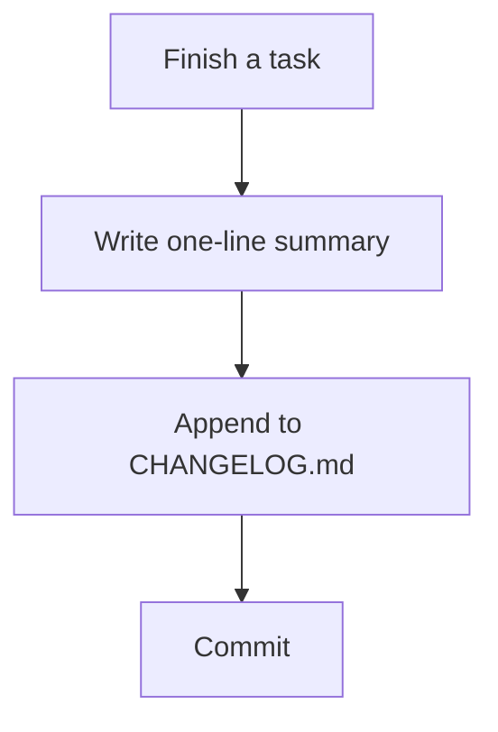

# Diagram — Changelog Entry Workflow (example)

**Date:** 2026-08-05
**Stage:** 1 — Diagram

## Flow / State Diagram

## Notes

The diagram assumes CHANGELOG.md already exists. A missing file needs a setup step this example does not cover.
