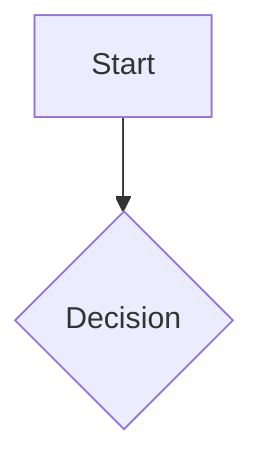

# Diagram — <Workflow Name>

**Date:**
**Stage:** 1 — Diagram

## Flow / State Diagram

<!-- Sketch the chosen approach as a mermaid flow or state diagram. Capture entry points, steps, decision points, gates, and exit or failure states. -->

## Notes

<!-- Record open questions or assumptions the diagram makes. -->
