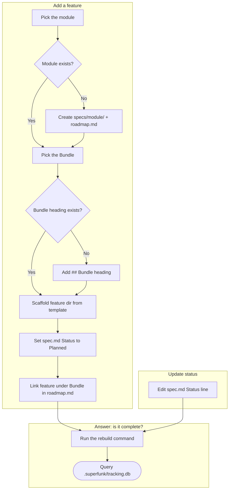

# Diagram — Feature Tracking

**Date:** 2026-08-10
**Stage:** 1 — Diagram

## Flow / State Diagram

## Notes

This diagram assumes rebuilding the index stays cheap enough to run before every query, avoiding any staleness-detection logic entirely. Criteria and Trials should confirm this holds at a realistic feature count.

Feature Intake assumes a feature belongs to exactly one module. Cross-cutting features spanning multiple modules have no defined home yet — an open risk one of the four lenses (Robustness) already flagged.

"Pick the module" assumes the target codebase already organizes into clear modules. A project without that structure yet, including `superfunk` itself today, has no defined fallback in this diagram.
