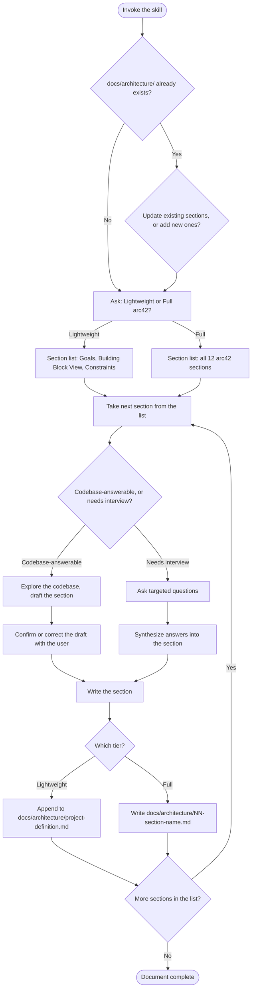

# Diagram — Project Definition Skill

**Date:** 2026-08-10
**Stage:** 1 — Diagram

## Flow / State Diagram

## Notes

This diagram leaves the exact codebase-answerable-vs-interview classification unresolved beyond the three lightweight-tier sections. Building Block View and Deployment View lean codebase-first. Goals, Constraints, and Quality Requirements lean interview-first. Several full-tier sections — Context and Scope, Crosscutting Concepts, Architecture Decisions, Risks, Glossary — plausibly draw on both. Criteria and Trials need to pin this down per section, not just assert the two-category split holds everywhere.

Architecture Decisions (arc42 section #9) may draw on this project's own per-feature `decisions.md` files as a codebase-adjacent source, not just interview. This needs testing, not an assumption.

The "update existing sections" path only shows a single decision node here. It doesn't yet define how the skill decides which specific sections need updating. It also doesn't define how the skill reconciles a codebase that changed with a section a user already hand-edited. Both need more design before Trials exercise this path.
