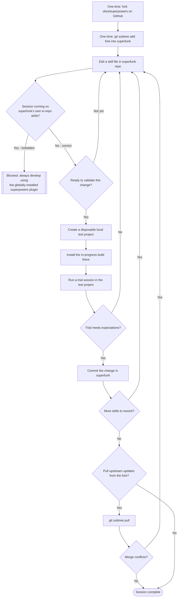

# Diagram — Superpowers Fork

**Date:** 2026-08-08
**Stage:** 1 — Diagram

## Flow / State Diagram

## Notes

This diagram assumes Claude Code supports installing a plugin from a local path — the Trials stage needs to confirm this. "Disposable local test project" means a throwaway directory outside version control, not a location `superfunk` tracks.

The forbidden path — a `superfunk` session running on its own in-repo skills — has no automated guard yet. It stays a discipline rule for now. A later workflow can design an automated guard if the trials show discipline alone doesn't hold, echoing what happened to Casita's sync rule.

This diagram doesn't yet specify where forked skill files live inside `superfunk` relative to existing `docs/` and `workflows/` content. That directory-layout decision belongs to a later stage or a follow-up workflow.
